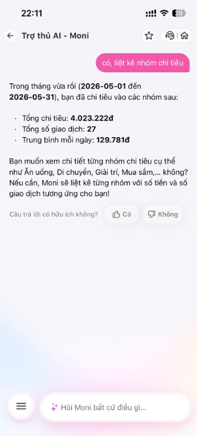

# Workshop — Mổ App AI Thật

## Sản phẩm chọn

**Product:** MoMo — Moni
**AI feature:** Trợ lý tài chính AI, chatbot hỗ trợ quản lý chi tiêu
**Cách truy cập:** App MoMo

---

# 2. Promise vs Reality

## Product hứa gì?

Moni được định vị là trợ lý tài chính AI giúp người dùng:

* Theo dõi chi tiêu cá nhân.
* Phân tích các khoản chi.
* Hiểu dòng tiền của bản thân.
* Đưa ra gợi ý quản lý tài chính.
* Hỗ trợ truy vấn dữ liệu tài chính bằng ngôn ngữ tự nhiên.

## User nào được hứa sẽ được giúp?

* Người dùng MoMo muốn theo dõi tài chính cá nhân.
* Người không có thói quen ghi chép chi tiêu.
* Người muốn biết mình đang tiêu tiền vào đâu.

## Task được kiểm thử

### Quản lý chi tiêu / Báo cáo tài chính

#### User

> Tháng vừa rồi tôi chi tiêu vào các lĩnh vực nào?

#### Moni

Trả về:

* Tổng chi tiêu: 4.023.222đ
* Tổng số giao dịch: 27
* Trung bình mỗi ngày: 129.781đ

Sau đó nói:

> Nếu bạn muốn xem chi tiết từng lĩnh vực (nhóm chi tiêu) cụ thể, hãy cho Moni biết nhé.

---

#### User

> Có, liệt kê nhóm chi tiêu

#### Moni

Tiếp tục trả về:

* Tổng chi tiêu: 4.023.222đ
* Tổng số giao dịch: 27
* Trung bình mỗi ngày: 129.781đ

và hỏi lại:

> Bạn muốn xem chi tiết từng nhóm chi tiêu cụ thể như Ăn uống, Di chuyển, Giải trí, Mua sắm,... không?

---

#### User

> Muốn

#### Moni

Tiếp tục trả về:

* Tổng chi tiêu: 4.023.222đ
* Tổng số giao dịch: 27
* Trung bình mỗi ngày: 129.781đ

Sau đó nói:

> Hiện tại mình chưa có thông tin chi tiết từng nhóm chi tiêu cụ thể.

---

## Kỳ vọng

Khi user hỏi:

> Tháng vừa rồi tôi chi tiêu vào các lĩnh vực nào?

AI nên:

### Bước 1

Hiển thị breakdown theo danh mục

| Nhóm      | Số tiền |
| --------- | ------: |
| Ăn uống   |     xxx |
| Di chuyển |     xxx |
| Giải trí  |     xxx |
| Mua sắm   |     xxx |

### Bước 2

Cho phép drill-down

Ví dụ:

> Xem riêng Giải trí

↓

Liệt kê giao dịch thuộc nhóm Giải trí.

### Bước 3

Đưa insight

Ví dụ:

* Ăn uống chiếm 42% tổng chi tiêu.
* Giải trí tăng 35% so với tháng trước.
* Nhóm có tốc độ tăng nhanh nhất là Mua sắm.

---

## Thực tế

Moni chỉ truy xuất được dữ liệu tổng hợp:

* Tổng chi tiêu
* Số giao dịch
* Trung bình mỗi ngày

Khi user yêu cầu xem chi tiết:

> Có

hoặc

> Muốn

hệ thống không drill-down xuống nhóm chi tiêu.

Thay vào đó:

* lặp lại dữ liệu cũ,
* tiếp tục hỏi lại,
* cuối cùng xác nhận không có dữ liệu chi tiết.

Kết quả là user bị đưa vào vòng lặp hội thoại.




---

# 3. Phân tích 4 Paths

## Happy Path

### Kỳ vọng

```text
User hỏi chi tiêu theo lĩnh vực

↓

Moni lấy dữ liệu danh mục

↓

Hiển thị breakdown

↓

User drill-down

↓

Moni phân tích chi tiết
```

### Thực tế

Không xảy ra.

---

## Low-confidence Path

### Kỳ vọng

Nếu không chắc user muốn:

* xem danh mục
* xem giao dịch
* xem báo cáo

Moni nên hỏi lại bằng lựa chọn rõ ràng.

### Thực tế

Moni hiểu đúng ý định.

Không có vấn đề ở Intent.

---

## Failure Path

### Kỳ vọng

Nếu tool không có dữ liệu danh mục:

Moni phải nói rõ:

> Hiện tại mình chỉ truy cập được dữ liệu tổng hợp.

### Thực tế

Moni vẫn gợi ý:

> Bạn muốn xem chi tiết không?

trong khi không thể thực hiện hành động đó.

---

## Correction Path

### Kỳ vọng

Nếu user đổi cách hỏi hoặc xác nhận muốn xem chi tiết:

Moni phải chuyển sang bước tiếp theo.

### Thực tế

User đã xác nhận nhiều lần:

> Có

> Muốn

nhưng hệ thống không thay đổi hành vi.

Correction không tạo ra state mới.

---

# 4. Điểm gãy

| # | Kỳ vọng                                        | Thực tế                                            | Mức độ     |
| - | ---------------------------------------------- | -------------------------------------------------- | ---------- |
| 1 | AI phân tích theo nhóm chi tiêu                | Chỉ trả về tổng chi tiêu                           | Cao        |
| 2 | User chọn "Có" sẽ đi tiếp sang bước drill-down | Hệ thống lặp lại câu trả lời cũ                    | Cao        |
| 3 | CTA "xem chi tiết" hoạt động                   | CTA dẫn tới ngõ cụt                                | Cao        |
| 4 | AI chỉ hứa những gì tool làm được              | AI liên tục gợi ý xem chi tiết dù không có dữ liệu | Cao        |
| 5 | Tool lỗi sẽ có fallback rõ ràng                | User bị đưa vào vòng lặp hội thoại                 | Trung bình |

---

# 5. Finding

## Finding 01 — Dead-end CTA

### Trigger

User yêu cầu:

> Có

hoặc

> Muốn xem chi tiết nhóm chi tiêu.

### Failure

AI tiếp tục hiển thị dữ liệu tổng hợp thay vì gọi bước phân tích theo danh mục.

### Impact

* User nghĩ hệ thống bị lỗi.
* User mất niềm tin vào khả năng phân tích tài chính.
* CTA trở thành hành động giả (fake affordance).

### Layer

* Data / Tool
* UX Recovery

### Recommendation

Nếu backend không hỗ trợ dữ liệu phân nhóm:

Không được hiển thị CTA:

> Bạn muốn xem chi tiết không?

Ngược lại, nếu CTA xuất hiện thì bắt buộc:

```text
User
↓

Đồng ý xem chi tiết

↓

Call expense_breakdown_tool

↓

Hiển thị danh mục

↓

Cho phép drill-down
```

---

# 6. Sketch

## AS-IS

```text
User:
"Tháng vừa rồi tôi chi tiêu vào các lĩnh vực nào?"

↓

Moni

Tổng chi tiêu:
4.023.222đ

↓

"Bạn muốn xem chi tiết không?"

↓

User:
"Có"

↓

Moni

Lặp lại dữ liệu cũ

↓

"Bạn muốn xem chi tiết không?"

↓

User:
"Muốn"

↓

"Hiện tại chưa có dữ liệu"

↓

Dead-end
```

---

## TO-BE

```text
User:
"Tháng vừa rồi tôi chi tiêu vào các lĩnh vực nào?"

↓

expense_breakdown_tool

↓

Ăn uống
Di chuyển
Giải trí
Mua sắm

↓

User chọn danh mục

↓

Moni drill-down

↓

Insight + khuyến nghị
```

---

# 7. SPEC Change

Nếu AI đề xuất một hành động tiếp theo (CTA), hệ thống phải xác minh trước rằng backend hoặc tool tương ứng có thể thực hiện hành động đó.

Không được tạo CTA dẫn tới ngõ cụt hoặc vòng lặp hội thoại.

Mọi CTA đều phải có action thực thi tương ứng hoặc fallback rõ ràng.
