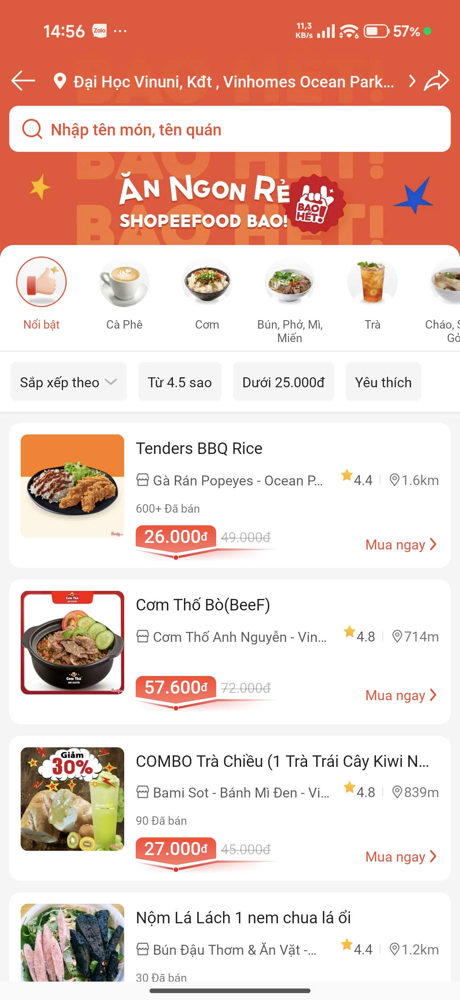
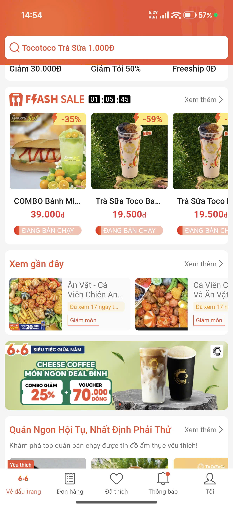
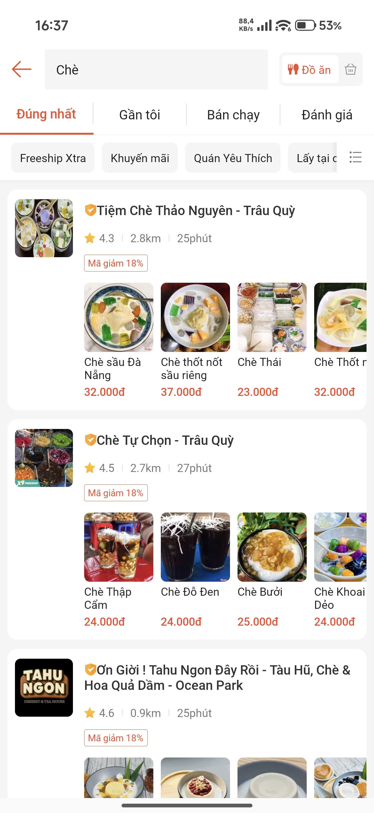
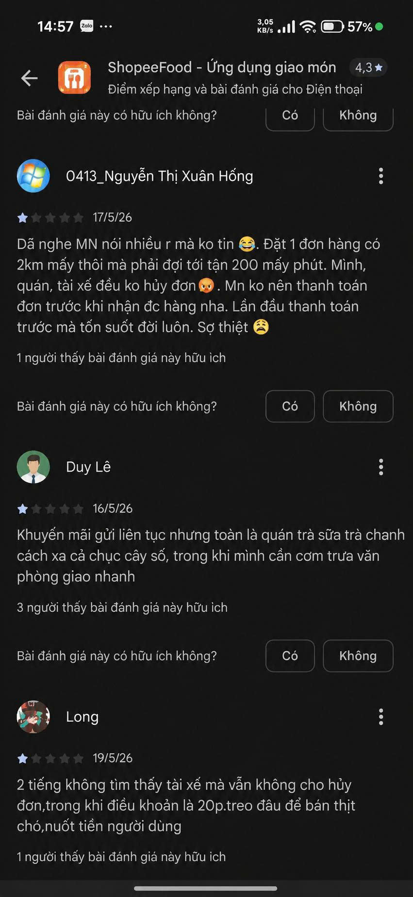

# Evidence Pack — ShopeeFood AI Personalized Promotion

**Nhóm:** "Xứ Sở Ba Tư"

**Thành Viên:**

Phan Tân Hưng - 2A202600825

Khưu Minh Toàn - 2A202601011

Đoàn Xuân Thạch - 2A202600950

Nguyễn Bùi Tấn Dũng - 2A202600546

**Track:** C - Food & Local Delivery

**Product/app đã chọn:** ShopeeFood

**Build slice đang nghĩ:** Tính năng AI cá nhân hóa chương trình khuyến mãi (Banner, Voucher) và gợi ý món ngon thông minh theo phân khúc độ tuổi (Học sinh, Sinh viên, Nhân viên văn phòng).

---

## 2. Self-use evidence

Nhóm tự dùng app/workflow và ghi lại điểm gãy:

| Observation | Screenshot/link | Path liên quan | Điều học được |
|---|---|---|---|
| Trang chủ ShopeeFood có quá nhiều banner khuyến mãi, flash sale, category chồng chéo làm rối mắt, không có phân tách nhóm nhu cầu rõ ràng. | [Home Screenshot] | Happy -> Low-confidence | Gợi ý chung chung gây mệt mỏi tinh thần (Decision Fatigue). Cần phân tách nhóm độ tuổi để tự động lọc bớt các deals không liên quan. |
| Bộ lọc tìm kiếm (Filter) thủ công phức tạp, không hiểu được các ràng buộc ngôn ngữ tự nhiên (ví dụ muốn ăn trưa healthy dưới 60k, không cay). | [Search Screenshot]  | Happy -> Failure | Các bộ lọc mặc định không kiểm soát được các hard constraints (như dị ứng, độ cay, đồ ăn chay), dễ dẫn đến việc đề xuất sai món.  |
| Hệ thống hiển thị các đề xuất quán ăn và voucher đại trà, chưa có sự cá nhân hóa dựa trên lịch sử đặt hàng, sở thích hay phân khúc chi tiêu của người dùng. | [Personalization Feedback] | Happy -> Low-confidence | Thiếu cá nhân hóa hành vi khiến đề xuất kém hấp dẫn. Cần AI học từ lịch sử giao dịch và phân khúc để phân bổ voucher và quán ăn phù hợp cho từng cá nhân. |

---

## 3. User / review / social evidence

Nguồn thu thập từ review thực tế trên App Store / Google Play:

| Quote / review / observation | Nguồn | User là ai? | Pain/failure mode |
|---|---|---|---|
| "Khuyến mãi gửi liên tục nhưng toàn là quán trà sữa trà chanh cách xa cả chục cây số, trong khi mình cần cơm trưa văn phòng giao nhanh." | App Store Reviews | Nhân viên văn phòng | Low-confidence / Spammed |
| "App bắt chờ tài xế quá lâu, không hủy được đơn, đói lả cả người mà vào Help Center chỉ thấy bot tự động trả lời FAQ chung chung." | App Store Reviews | Sinh viên / Người bận rộn | Failure / Order delay support friction |
| "App đề xuất khuyến mãi rất lộn xộn, không đúng gu ăn uống. Mình ăn healthy/ăn chay nhưng trang chủ toàn hiện banner quảng cáo gà rán, trà sữa béo ngậy." | Google Play Reviews | Người ăn healthy / chay | Low-confidence / Irrelevant recommendations |

---

## 4. Competitor / analog evidence

| App / mô hình tham khảo | Họ xử lý task này thế nào? | Pattern học được | Có áp dụng trong 1 ngày không? |
|---|---|---|---|
| **GrabFood** | Áp dụng cơ chế phân cụm thói quen đặt hàng (GrabFood tuyển chọn, Gọi nhóm) và gửi voucher giảm giá chính xác theo mức chi tiêu của tài khoản. | Thiết lập bộ lọc động và điều hướng thông minh dựa trên hành vi chi tiêu trung bình (AOV). | **Có**, mô phỏng trong thuật toán phân bổ voucher của Prototype. |
| **Baemin (cũ)** | Sử dụng bộ nhận diện linh vật Mèo Béo và biên soạn nội dung quảng cáo mang phong cách trẻ trung, teencode cực kỳ thu hút giới học sinh - sinh viên. | Cá nhân hóa văn phong (Tone of Voice) và thiết kế banner phù hợp với văn hóa của từng độ tuổi. | **Có**, mô phỏng qua bộ Dynamic Creative Gen của Prototype. |

---

## 5. Evidence -> Insight

```text
Evidence nổi bật nhất:
1. Review và tự trải nghiệm cho thấy trang chủ bị quá tải thông tin (Discovery Overload), khuyến mãi tràn lan nhưng không đúng nhu cầu của từng đối tượng (ví dụ: nhân viên văn phòng cần cơm trưa nhanh, người ăn healthy/ăn chay lại bị gợi ý gà rán, trà sữa).
2. Bộ lọc tìm kiếm thủ công quá phức tạp và không xử lý được các ràng buộc tự nhiên (như ngân sách, độ cay, đồ ăn chay).

Insight:
User không chỉ gặp vấn đề bề mặt là thiếu voucher. Thực chất họ cần một bộ lọc thông minh tự động (auto-curation) tự hiểu khẩu vị cá nhân (healthy, chay, độ cay), thói quen ăn uống và phân khúc ngân sách theo thời gian thực tế để hỗ trợ ra quyết định nhanh chóng mà không bị Decision Fatigue.

Opportunity:
AI có thể giúp bằng cách tự động dự đoán phân khúc người dùng (Học sinh/Sinh viên/Văn phòng) và nhận diện sở thích ẩm thực (healthy, ăn chay, v.v.). Từ đó tự động lọc, xếp hạng và cá nhân hóa banner khuyến mãi/voucher phù hợp nhất với nhóm tuổi và gu ăn uống đó để tối ưu hóa tỷ lệ chuyển đổi.
```

---

## 6. Evidence đổi SPEC như thế nào?

- [x] Đổi user chính.
- [x] Đổi pain statement.
- [x] Đổi build slice.
- [x] Đổi Auto/Aug decision.
- [x] Đổi 4 paths.
- [x] Đổi failure mode.
- [x] Đổi owner/test plan.

Ghi rõ thay đổi quan trọng:
```text
Trước evidence, nhóm định:
Xây dựng một chatbot AI chung chung đặt tại Help Center để tư vấn tất cả các món ăn trên toàn cơ sở dữ liệu ShopeeFood.

Sau evidence, nhóm đổi thành:
- Tích hợp trực tiếp lớp AI thông minh tự động cá nhân hóa giao diện Trang chủ (Home Banner, Voucher carousel, Gợi ý món) theo phân khúc độ tuổi và thói quen ăn uống (thiên về Automated Decision - hệ thống tự chọn hiển thị cho người dùng).
- Xây dựng thêm luồng hỗ trợ tìm món nhanh bằng ngôn ngữ tự nhiên ngay trên màn hình chính.
- Đo lường bằng tỷ lệ click banner (CTR), tỷ lệ đổi voucher thành công (Redemption Rate) và tỷ lệ chuyển đổi đơn hàng (Conversion Rate).

Lý do:
User gặp điểm đau lớn nhất ở khâu Decision Fatigue ngay khi vừa mở app và thiếu sự cá nhân hóa về ngân sách/gu ăn uống. Đặt AI chatbot ở Help Center là quá muộn và không giải quyết được khâu chọn món ban đầu.
```
